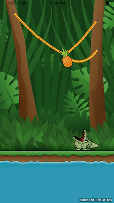

# Snip the Rope

## Project

This is a simple app built like Cut the Rope. It was built in the tutorial at raywenderlich.com to show how to create a game like Cut the Rope using SpriteKit. The game features a pineapple held in place by vines. The player must cut the vines so that the pineapple falls into the crocodile's mouth.

## Purpose

The purpose of the project is to demonstrate SpriteKit physics. It also shows how to create a game much like the once popular game, Cut the Rope. This project is also meant to demonstrate uploading an app to the app store. 

In this repo, the game has been modified to only support the iPhone as well as contain additional levels. Finally, after a certain amount of failures, the user will be notified that they will be able to create this game by going to raywenderlich.com.

## Original Tutorial

The tutorial can be found at [raywenderlich.com](https://www.raywenderlich.com/5347797-how-to-make-a-game-like-cut-the-rope-with-spritekit)

## Technology

The game is up to date on the latest version of Xcode (11) and the current version of iOS (13). The game uses the SpriteKit library included with iOS. Icons are created using the Gimp photo editor. 
